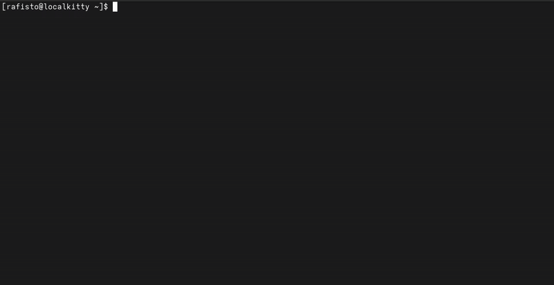
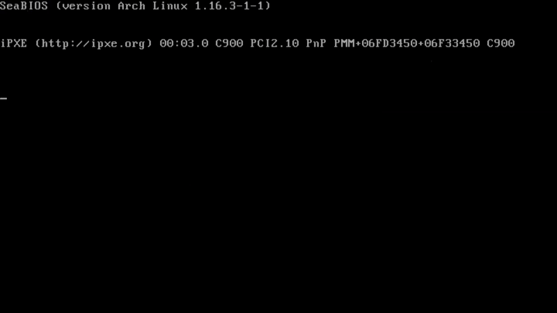
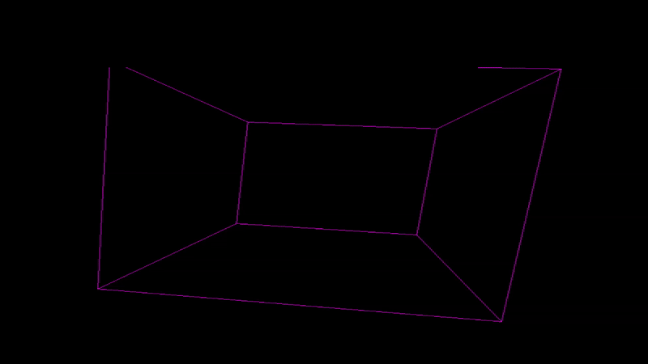
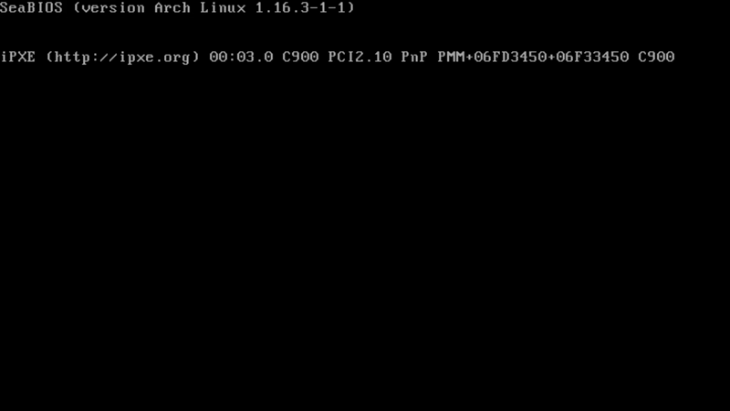
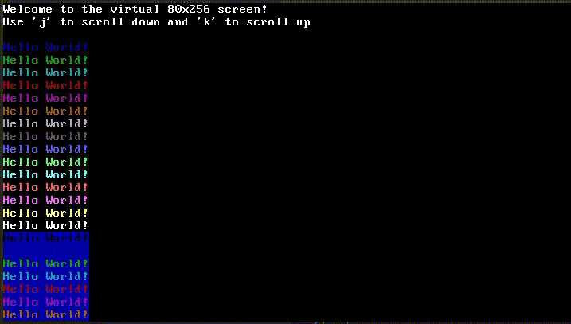

Table of Contents

- [Serial](#serial) - A challenge I made for BtSCTF 2025.
- [Screen](#screen) - Text mode in framebuffer using a generated character set bitmap.
- [Framebuffer](#framebuffer) - Rotating a cube using framebuffer set in the bootloader.
- [Command Line Interface](#command-line-interface) - CLI with a few commands to interact with the system.
- [Keyboard on Interrupts](#keyboard-on-interrupts) - Keyboard controller on x86 with GDT, IDT and IRQ.
- [VGA Rainbow](#vga-rainbow) - Display *Hello World!* in all colors provided by VGA text mode.

## Serial

The `misc/serial` is a challenge I made for [Break the Syntax CTF 2025](https://ctftime.org/event/2749). The contestants had to find out that the device, which simulated actions performed by a chinese ethernet switch, is sending morse code after specific number of PIC interrupts, then browse through a program memory. There were only a few solves.



Feel free to check out my [original writeup for this challenge](./serial/_solve/WRITEUP.md)
 
## Screen

Ported the [command line interface](#command-line-interface) to now use framebuffer instead of VGA Text Mode. The graphic mode is set to `1024x768x32` which means the system now supports RGB colors and visual effects, such as the OS-logotype.



## Framebuffer

I configured the framebuffer in GRUB and have managed to request its address using [Multiboot2 headers](./framebuffer/multiboot_header.asm#L26). I also enabled the [FPU and SSE instructions](./framebuffer/boot.asm#L21) to be used in the program. The framebuffer is then used to show a rotating pink cube.



Having no stdlib I wrote a few alogrithms, `sin`, `cos` using Taylor series approximation and line drawing using Bresenham's algorithm. The cube is drawn using 8 vertices and 12 edges. It is then rotated along each axis. 

## Command Line Interface

CLI presents a few commands to interact with the system. It allows for specifying up to 16 arguments for each command. Just by adding a new function to the `commands.c` and updating the `commands.h` file you can add a new command.



```c
void sum_command(int argc, char** argv) {
    int sum = 0;
    for (int i = 1; i < argc; i++) {
        sum += atoi(argv[i]);
    }
    write_format("%d\n", sum);
}
```

I also added simple `kalloc()` and set up paging to be used later for dynamic memory allocation. 

## Keyboard on Interrupts

KBD is a continuation of my bare-metal journey. Thanks to this [stackoverflow answer](https://stackoverflow.com/a/37635449) I was able to successfully recreate a keyboard controller on interrupts.


Most of the program is done in [boot.asm](./kbd/boot.asm), where I initialize GDT, and in [idt.h](./kbd/idt/idt.h), where I use the interrupt controller. A little dependency injection was made in the `console.c`, as the `console_input()` is actually passed as a function to be called after a key is pressed.

## VGA Rainbow

VGA Rainbow is a small bare-metal program created to display *Hello World!* in all colors provided by [VGA text mode](https://en.wikipedia.org/wiki/VGA_text_mode).



This is an exetension of `hello-os` project, I added a simple [virtual screen](./vgarainbow/base/virtscr.h) and [keyboard controller](./vgarainbow/base/kbd.h) which can be further extended to create more complex programs.

## Tricks

You can debug the kernel using QEMU and GDB. Remember to compile the kernel with debug symbols.

```bash
make qemu-gdb
gdb -ex "target remote localhost:1234" -ex "symbol-file _build/kernel.elf"
```

In order to run the kernel on a real machine, you can create a bootable USB stick.

```bash
sudo dd if=_build/hello.iso of=/dev/sdb bs=1MB 
sync
```
